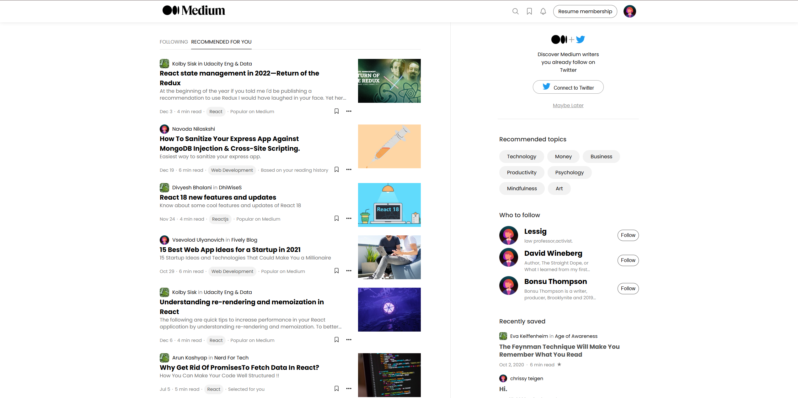
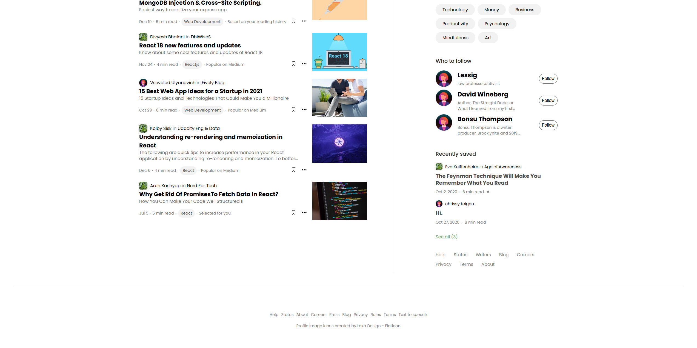

# Titolo del Progetto

Medium

In questo progetto dovevamo ricreare una pagina del blog di Medium. L’esercizio era incentrato principalmente sull’utilizzo della proprietà "flex", argomento affrontato durante questa settimana di corso.

## Obiettivo del progetto

Lo scopo dell’esercizio era ricreare fedelmente la pagina di Medium, rispettando il più possibile la reference fornita. Il layout doveva essere realizzato esclusivamente per desktop, senza l’utilizzo di media query.

## Tecnologie utilizzate

- HTML
- CSS

## Esempi / Screenshot

## Confronto

### Reference originale

### Mio risultato finale

## Problemi riscontrati e soluzioni adottate

Le difficoltà principali che ho riscontrato hanno riguardato soprattutto la gestione delle larghezze tra la sidebar e il contenuto principale del progetto. Ricreare in modo fedele proporzioni, allineamenti e spaziature si è rivelata una sfida impegnativa.

Un altro aspetto complesso è stato gestire gli accapo dei titoli e delle descrizioni sotto gli articoli.

## Autore

Claudia Laici